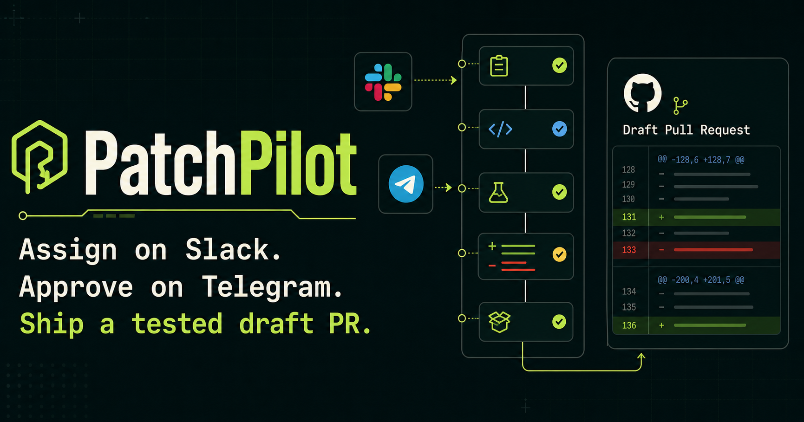
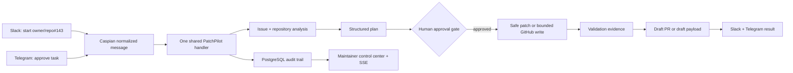

# PatchPilot

> Assign an issue from Slack. Approve the plan from Telegram. Receive a tested draft pull request on GitHub.

PatchPilot is the human coordination and safety layer for autonomous coding agents. It lets agents such as Codex work on real GitHub tasks while PatchPilot handles approvals, risk escalation, cross-channel human decisions, validation governance, audit history, and guarded PR publishing through Caspian-powered Slack and Telegram communication.

PatchPilot is deliberately not a generic chatbot. Every decision is represented as a stage, event, approval, artifact, or outcome in the maintainer control center.



## Why this exists

Maintainers coordinate in Slack and Telegram, but engineering truth lives in GitHub. Conventional bots fragment identity and duplicate channel logic; conventional coding agents hide progress in a separate interface. PatchPilot uses Caspian as the communication fabric so both channels enter one normalized handler and maintainers can approve from a different channel than the one that started the task.

Caspian is essential because it owns channel lifecycle, normalization, replies, threading, and webhook verification. PatchPilot owns engineering policy and workflow state. The adapter boundary means neither concern leaks into the other.

## The five-minute story



## What is implemented

- One Caspian `@client.on_message` handler for Slack and Telegram.
- Exact Caspian `Message` normalization: message, conversation, connection, channel, sender, and text.
- Deterministic slash commands plus bounded natural-language equivalents.
- Explicit workflow state machine; routes cannot mutate task state directly.
- GitHub issue, comment, repository metadata, and tree ingestion through the REST API.
- Heuristic file ranking and a validated structured implementation plan.
- Cross-channel approval with duplicate-message and duplicate-decision safeguards.
- Credential-free fake-agent fallback with visibly labeled simulated evidence.
- Optional real validation using allowlisted, argument-vector execution without a shell.
- Opt-in GitHub write mode that publishes the real Codex-generated diff on a task branch and opens a draft PR. It never merges, force-pushes, or writes to the base branch.
- FastAPI API, PostgreSQL persistence, Alembic migration, pagination, filtering, and SSE.
- Responsive Next.js maintainer console with dashboard, live task detail, repository policy, and channel configuration.
- Seeded completed, awaiting-approval, and failed missions.
- Docker Compose for `web`, `api`, and `postgres` with health checks and a persistent volume.

## Screenshots

The generated social preview above is checked in at `apps/web/public/og.png`. Replace these handoff placeholders with captures from the running Compose stack before submission:

- Dashboard: active missions, channel status, and recent activity.
- Task detail: workflow progress, cross-channel approval, live timeline, and validation evidence.
- Repository policy: protected paths, validation commands, and autonomy configuration.
- Channel settings: Slack and Telegram readiness without exposed secrets.

## Quick start with Docker

Prerequisites: Docker Desktop with Compose v2.

```bash
cp .env.example .env
docker compose up --build
```

Then open:

- Maintainer console: <http://localhost:3000/dashboard>
- API: <http://localhost:8000>
- OpenAPI docs: <http://localhost:8000/docs>
- Readiness: <http://localhost:8000/health/ready>

Alembic migrations and idempotent demo seeding run automatically when the API container starts.

## Demo without credentials

Safe demo mode is the default. The dashboard is useful immediately because startup seeds Slack and Telegram connection records plus three missions.

To create a new mission, pause at approval, wait four seconds, approve from simulated Telegram, validate, and prepare a draft PR payload:

```bash
make demo
# or
docker compose exec api python -m patchpilot.demo
```

Open the printed task ID at `http://localhost:3000/tasks/<task-id>` before the approval delay to watch its SSE timeline.

## Real Slack + Telegram through Caspian

The integration was verified against the live Caspian guide and the `caspian-sdk` 0.6.x Python client on 6 August 2026. See [docs/caspian-setup.md](docs/caspian-setup.md) for exact setup.

At minimum:

```dotenv
CASPIAN_ENABLED=true
CASPIAN_API_KEY=comm_sandbox_...
CASPIAN_BASE_URL=https://api.trycaspianai.com
CASPIAN_TELEGRAM_BOT_TOKEN=...
CASPIAN_SLACK_MODE=quick
CASPIAN_SLACK_DISPLAY_NAME=PatchPilot
```

The SDK listener polls Caspian's verified event stream. Therefore PatchPilot intentionally does **not** expose a fake `/api/caspian/webhook` endpoint. Platform webhooks terminate at Caspian, which verifies signatures and emits normalized events.

## Command language

```text
/patchpilot start owner/repository#143
/patchpilot status <task-id>
/patchpilot approve <task-id>
/patchpilot reject <task-id> reason
/patchpilot cancel <task-id>
/patchpilot help
```

Also supported:

```text
Analyze issue 143 in owner/repository
Approve task 6bb...
What is the status of task 6bb...?
```

Task prefixes must resolve uniquely. Deterministic commands do not depend on an LLM.

## Safety model

- `PATCHPILOT_DEMO_MODE=true` and `GITHUB_WRITE_ENABLED=false` by default.
- No implementation runs before an explicit approval record exists.
- Protected paths are checked before artifact creation and before GitHub writes.
- Validation commands come from repository configuration, use an executable allowlist, reject shell operators, and execute without a shell.
- GitHub write mode only creates a new branch and draft PR; it cannot merge or force-push.
- Secrets never appear in API responses, UI state, task events, or structured logs.
- Duplicate Caspian messages are rejected with a database uniqueness constraint.
- Decision summaries and structured evidence are stored; hidden chain-of-thought is not.

## GitHub modes

### Safe demo mode

Always available. PatchPilot creates structured plans and preserves local changes. Without a real checkout, validation and publishing are represented as clearly labeled safe-mode evidence.

### Write mode

Set both values only for a repository and token you control:

```dotenv
PATCHPILOT_DEMO_MODE=false
GITHUB_WRITE_ENABLED=true
GITHUB_TOKEN=github_pat_...
```

PatchPilot verifies the known source commit and isolated workspace, enforces protected paths, creates `patchpilot/issue-<number>-<task>`, commits the actual Codex-generated diff, pushes only that task branch, and opens a GitHub draft PR. It persists PR metadata and notifies maintainers. It never merges, force-pushes, or writes the default branch.

## Environment reference

| Variable | Purpose | Default |
|---|---|---|
| `APP_ENV` | Runtime label | `development` |
| `APP_SECRET_KEY` | Application secret material | must be changed |
| `DATABASE_URL` | SQLAlchemy database URL | Compose overrides to PostgreSQL |
| `POSTGRES_PASSWORD` | Local Compose database password | `patchpilot-local` |
| `FRONTEND_URL` | CORS origin | `http://localhost:3000` |
| `API_PUBLIC_URL` | Public API URL for links | `http://localhost:8000` |
| `NEXT_PUBLIC_API_URL` | Browser-visible API URL | `http://localhost:8000` |
| `NEXT_PUBLIC_APP_URL` | Canonical frontend URL / metadata base | `http://localhost:3000` |
| `AUTO_CREATE_SCHEMA` | Dev-only metadata creation | `false` in Compose |
| `SEED_DEMO_DATA` | Idempotent sample data | `true` |
| `GITHUB_TOKEN` | GitHub REST read/write authentication | empty |
| `GITHUB_WRITE_ENABLED` | Enables the bounded draft-PR write path | `false` |
| `PATCHPILOT_DEMO_MODE` | Enables credential-free fallbacks | `true` |
| `DEMO_REPOSITORY_PATH` | Optional checked-out sandbox for real validation | empty |
| `LLM_PROVIDER` | Planner provider; deterministic is built in | `deterministic` |
| `LLM_API_KEY` / `LLM_MODEL` | Optional LLM configuration | empty / deterministic model label |
| `CASPIAN_ENABLED` | Starts Caspian connections and listener | `false` |
| `CASPIAN_API_KEY` | Caspian project API key | empty |
| `CASPIAN_BASE_URL` | Caspian gateway | hosted gateway |
| `CASPIAN_START_LISTENER` | Starts the shared polling listener | `true` |
| `CASPIAN_TELEGRAM_BOT_TOKEN` | BotFather token | empty |
| `CASPIAN_SLACK_MODE` | `quick`, `branded`, or `socket` | `quick` |
| `CASPIAN_SLACK_DISPLAY_NAME` / `ICON_URL` | Quick-mode identity | `PatchPilot` / empty |
| `CASPIAN_SLACK_CLIENT_ID` / `CLIENT_SECRET` / `SIGNING_SECRET` | Branded Slack OAuth app | empty |
| `CASPIAN_SLACK_BOT_TOKEN` / `APP_TOKEN` | Slack Socket Mode | empty |

## Local development

Backend (Python 3.12):

```bash
cd apps/api
python -m venv .venv
source .venv/bin/activate  # Windows: .venv\Scripts\activate
pip install -e '.[dev]'
alembic -c alembic.ini upgrade head
uvicorn patchpilot.main:app --reload
```

Frontend (Node 22 + pnpm):

```bash
cd apps/web
pnpm install
pnpm dev
```

## Tests and quality checks

```bash
make test
make lint
docker compose build
```

Direct equivalents:

```bash
cd apps/api && pytest && ruff check patchpilot tests
cd apps/web && pnpm test && pnpm lint && pnpm build
```

The Compose API image uses the Dockerfile's explicit development/demo target, so backend checks can also run in the container:

```bash
docker compose exec api pytest
docker compose exec api ruff check .
```

Backend tests cover commands, normalization, state transitions, cross-channel approval, idempotency, identifiers, protected paths, command execution policy, plan validation, API persistence, and SSE. Frontend tests cover task rendering, live timeline evidence, approval controls, and empty states.

## Repository layout

```text
apps/api/       FastAPI, SQLAlchemy, Alembic, workflows, GitHub, Caspian
apps/web/       Next.js App Router maintainer console
docs/           architecture, Caspian setup, five-minute demo
docker-compose.yml
.env.example
Makefile
```

## Documentation

- [Architecture and security boundaries](docs/architecture.md)
- [Exact Caspian Slack and Telegram setup](docs/caspian-setup.md)
- [Five-minute judging demo](docs/demo-script.md)

## Current prototype boundaries

- Live Caspian, Codex, and GitHub behavior is documented from the verified end-to-end demo; credential-free fake-agent mode remains the reproducible fallback.
- Safe demo mode, deterministic planning, persistence, API, SSE, and console behavior are covered by automated tests.
- Real validation requires a mounted checkout at `DEMO_REPOSITORY_PATH` and repository-configured commands.
- The optional GitHub write path commits the actual Codex-generated diff only after workspace, policy, approval, and validation gates pass.
- Publishing the repository and recording the demo video are submission-owner actions.

## Hackathon submission checklist

- [x] Uses `caspian-sdk`
- [x] Slack and Telegram adapters
- [x] One shared message handler
- [x] Working safe demo workflow
- [x] Human approval and audit trail
- [x] Docker Compose
- [x] Polished maintainer console
- [x] Automated tests and CI
- [ ] Push this code to a public GitHub repository
- [ ] Connect live Caspian credentials and record the demo video

Official references: [Caspian SDK repository](https://github.com/TryCaspian/caspian-sdk), [live Caspian integration guide](https://api.trycaspianai.com/SKILL.md), and [hackathon brief](https://unstop.com/hackathons/caspian-buildathon-build-agents-that-can-reach-anyone-caspian-1726439/amp).
