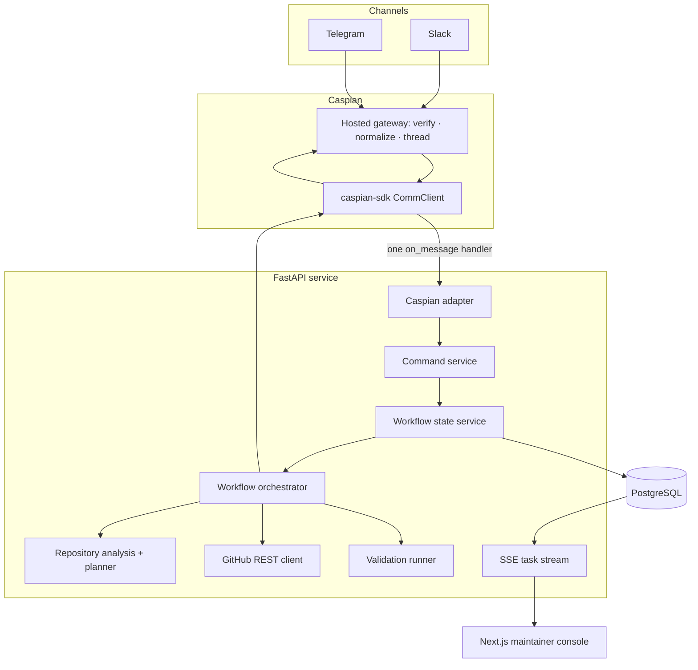
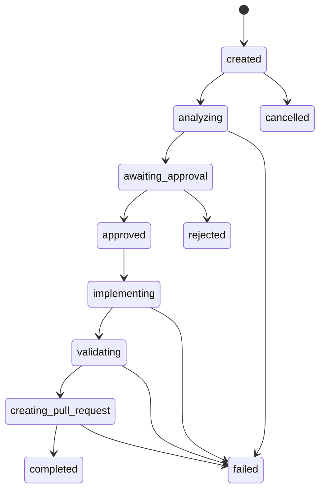

# PatchPilot architecture

## Design goal

PatchPilot separates communication plumbing from engineering policy. Caspian owns channel identity and transport. PatchPilot owns commands, authorization, repository analysis, approvals, execution safety, evidence, and lifecycle state.

## Components

## Boundaries

- `patchpilot/caspian/adapter.py` is the only module that imports `caspian_sdk`.
- `CommunicationGateway` is the framework-independent outbound protocol.
- Routes validate input, resolve resources, and delegate; they do not mutate workflow status.
- `WorkflowStateService` is the only workflow transition authority.
- `GitHubClient` contains REST mechanics; the orchestrator decides when GitHub may be called.
- `security.py` validates repository identifiers, protected paths, and validation commands.

## Caspian single-handler flow

1. Slack and Telegram connect to one `CommClient`.
2. The SDK emits the same `Message` shape for either channel.
3. One decorated handler calls `normalize_caspian_message`.
4. The internal `InboundMessage` preserves channel, sender, conversation ID, message ID, connection ID, and text.
5. A uniqueness constraint on `(channel, message_id)` makes delivery restart-safe.
6. `CommandService` parses the deterministic command and invokes the workflow.
7. Approval can resolve by full UUID or unique prefix from either channel.
8. Replies use the arriving message; proactive updates use `client.send_message(conversation_id, text=...)`.
9. Final results broadcast to the most recently observed Slack and Telegram conversations.

Platform webhooks do not terminate at PatchPilot. Caspian verifies Slack signing secrets and Telegram webhook secrets and exposes a normalized event stream. PatchPilot therefore uses `client.listen()` and does not imitate a Caspian webhook contract.

## State model

Every transition also writes a `TaskEvent` in the same database transaction. Stage-only progress is recorded without inventing extra statuses.

## Approval model

- Planning creates exactly one pending `implementation_plan` approval.
- Task status becomes `awaiting_approval`; write operations remain blocked.
- A decision records requested channel/person and responding channel/person independently.
- Only pending approvals can be resolved.
- Completed, rejected, failed, and cancelled tasks are terminal.
- Duplicate Caspian deliveries stop at idempotency before command execution.

## Data model

- `Repository`: allowlisted repository settings, validation commands, protected paths, guidelines, autonomy.
- `AgentTask`: durable issue workflow, current status/stage, origin, branch, PR, and failure.
- `TaskEvent`: append-only audit facts and structured evidence in JSONB.
- `Approval`: human decision request and response identity/channel.
- `ChannelConnection`: secret-free connection state and last conversation activity.
- `ProcessedInboundMessage`: durable channel idempotency key.

## Repository analysis

The GitHub reader fetches issue title/body/labels/comments and repository metadata, then requests the recursive tree. Deterministic token-to-path scoring ranks at most eight files. Dependency caches, distributions, vendors, and lock files are penalized. The structured plan is validated by Pydantic before persistence.

## Execution and validation

### Safe demo

- Creates structured example diffs and patch metadata.
- Enforces protected paths.
- Simulates configured commands when no checkout exists.
- Prepares the full draft-PR payload.
- Marks all simulated evidence in JSON and the UI.

### Sandbox validation

- Requires an existing directory configured by `DEMO_REPOSITORY_PATH`.
- Reads only repository-configured lint/test commands.
- Rejects shell control operators and unknown executables.
- Executes an argument vector with `create_subprocess_exec`, never a shell.
- Captures command, exit code, duration, bounded output, and failure.

### GitHub write

- Requires explicit `GITHUB_WRITE_ENABLED=true`, a token, and prior approval.
- Resolves the configured base ref.
- Creates a new branch; it never updates or force-pushes an existing ref.
- Commits the actual Codex-generated diff after changed-file and protected-path checks.
- Creates a draft PR.
- Never merges.

## Security boundaries

- Secrets exist only in environment configuration and the Caspian/GitHub clients.
- Logs contain event names and redacted summaries, never credentials.
- The UI receives secret-free configuration summaries.
- Repository identifiers have a strict `owner/name` grammar.
- Protected paths include descendants and reject traversal.
- No GitHub write precedes persisted human approval.
- Simulated and live effects are separately represented.
- Hidden reasoning is not stored; structured decision summaries are.

## Live UI

The task detail page opens `GET /api/tasks/{id}/stream`. The API emits existing and new `TaskEvent` records as named SSE events, sends keep-alives, and closes cleanly after a terminal state. TanStack Query invalidates task detail on each event so the plan, approval, validation, PR, and timeline stay consistent.

